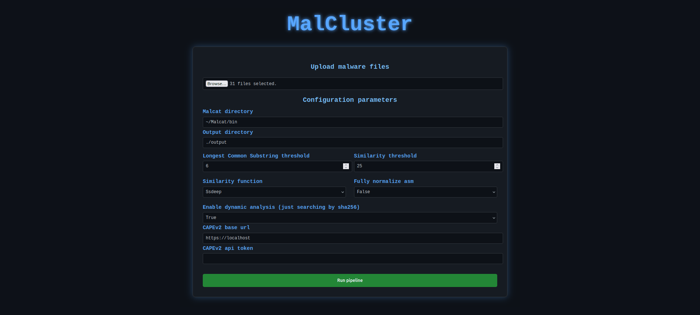

# Malware

**MalCluster** is a pipeline for extracting static and dynamic analysis artifacts from malware samples using the **Malcat** and **CAPEv2**, with a **Flask-based web GUI** for interactive usage.

<div align="center" style="display:flex; justify-content:center; gap:20px;">
  
</div>

## Installation
```bash
git clone https://github.com/federicofantini/malcluster.git
cd malcluster
python3 -m venv venv
source venv/bin/activate
python3 -m pip install -r requirements.txt
python3 app.py
```

## Overview

This tool clusters malware samples and extracts **core shared artefacts** by combining
static analysis, optional dynamic analysis, and progressive comparison inside each cluster.

The goal is **understanding** the malware families: what is truly common across samples, and what is sample-specific stuff.

---

## How the pipeline works:

### Clustering

Samples are grouped using **fuzzy-hash similarity**, with a selectable backend:

- **ssdeep**
- **TLSH**
- **sdhash**

The similarity backend and threshold are configurable from the GUI.

Furthermore, clustering is purely similarity-based.

---

### Static analysis (Malcat)

Static analysis is performed using **Malcat** and produces:

- **Strings** and **Frequency**
- **Per-function disassembly**

Disassembly is normalized by abstracting:
- registers
- immediates
- memory references

into placeholders.

An optional **full normalization** mode can be enabled, trading precision for robustness.

---

### Dynamic analysis (CAPEv2 - optional)

If enabled, dynamic analysis data is retrieved from **CAPEv2** (SHA256 lookup) without executing anything.

The following artefacts are collected when available:

- **Signatures**
- **Behavior summary**
- **API calls**
- **Dropped files**

Dynamic analysis is entirely optional and can be enabled or disabled from the GUI.

---

## Progressive compare (the core of MalCluster)

Progressive comparison operates **inside each cluster**.
Results are merged pairwise to extract the **shared artefacts** across all samples in the cluster.

The logic is conservative, so only artefacts that consistently survive merges are kept.

### Strings
- Set intersection across samples
- A **document-frequency counter** is maintained at cluster level

### Functions
- Compared using **Longest Common Substring (LCS)** on **normalized assembly**
- A function is kept if `LCS ≥ threshold`
- Functions are marked as **identical** when the normalized code matches exactly

### Behavior summary
- Pure **intersection**
- Only behaviors common to all samples survive

### Dropped files
- Work in progress...

### Signatures & API calls
- Merged using **Jaccard overlap** on sets
- **Hellinger distance** on counters to compare distributions
- This avoids collapsing unrelated behaviors while still tolerating noise

---

## Graph visualization

The left panel allows switching between datasets.

Some datasets also support alternative views (e.g. names vs categories).

Graphs are always cluster-centered: clusters are the anchor nodes, with artefacts arranged around them.

---

## Configuration parameters (GUI)

The pipeline is configured entirely from the web interface.

### Paths
- **Malcat directory**  
  Path to the Malcat binary directory
- **Output directory**  
  Where analysis results and cluster data are stored

### Static comparison
- **Longest Common Substring threshold**  
  Minimum LCS length (in normalized ASM lines) to keep a function match
- **Fully normalize asm**  
  Enable aggressive assembly normalization

### Clustering
- **Similarity function**  
  `ssdeep`, `tlsh`, or `sdhash`
- **Similarity threshold**  
  Threshold applied to the selected similarity backend  
  (note: TLSH uses distance, lower means more similar)

### Dynamic analysis
- **Enable dynamic analysis**  
  If enabled, CAPEv2 is queried by SHA256
- **CAPEv2 base URL**
- **CAPEv2 API token**
